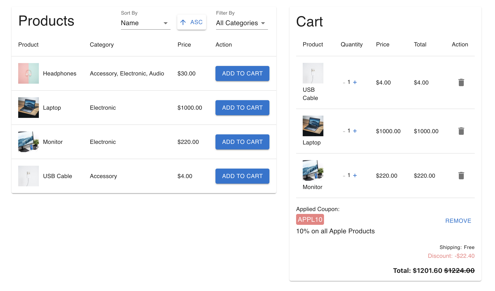

# Shopping Cart Project

This project is a web application that allows users to browse a list of products, add them to a shopping cart, and manage their selections. The application is built using TypeScript and React, and it provides a user-friendly interface for a seamless shopping experience.



## Features

1. **Product Listing:**

   - The web page displays a list of products retrieved from a remote server.
   - The products are presented in the form of a table for easy browsing.

2. **Sorting and Filtering:**

   - Users can sort the product list by name or price, in ascending or descending order.
   - Products can be filtered by category, allowing users to focus on specific types of products.

3. **Shopping Cart:**

   - Each product has an "Add to Cart" button that adds the product to the shopping cart.
   - Once a product is added to the cart, it cannot be added again until it is removed.
   - The shopping cart displays a table of added products with quantity adjustment buttons.

4. **Quantity Adjustment:**

   - In the shopping cart, each product has "+" and "-" buttons for users to increase or decrease the quantity.

5. **Total Price Calculation:**

   - The total price of all products in the cart is displayed at the bottom.
   - Shipping costs are considered in the total price calculation.

6. **Shipping Cost Rules:**

   - If the total value is less than $20, the shipping cost is $7.
   - If the total value is less than $40, the shipping cost is $5.
   - If the total value is $40 or more, shipping is free.

7. **Discount Coupons:**

   - Users can apply discount coupons for additional savings.
   - Supported coupon codes:
     - `freeShipping!`: Free shipping regardless of the total cost.
     - `APPL10`: 10% off all Apple products.
     - `AUDIO15`: 15% off all Audio products.
     - `ELEC25`: 25% off all Electronic products.

8. **Discount Display:**
   - The applied coupon and the total discount value are displayed.
   - The total price after applying the discount is shown.

## Technical Specifications

- **Technology Stack:**

  - TypeScript
  - React
  - Material UI
  - Jest
  - React Testing Library

- **Testing:**

  - The project includes unit tests for components and utility functions to ensure the code works as expected. The tests are implemented using Jest and React Testing Library. To run the tests, use the following command:

  ```bash
  npm test
  ```

## Getting Started

To run the project locally, follow these steps:

1. Clone the repository:

   ```bash
   git clone <repository-url>
   ```

2. Install dependencies:

   ```bash
   npm install
   ```

3. Start the development server:

   ```bash
   npm start
   ```

4. Open the application in your web browser:

   ```
   http://localhost:3000
   ```
